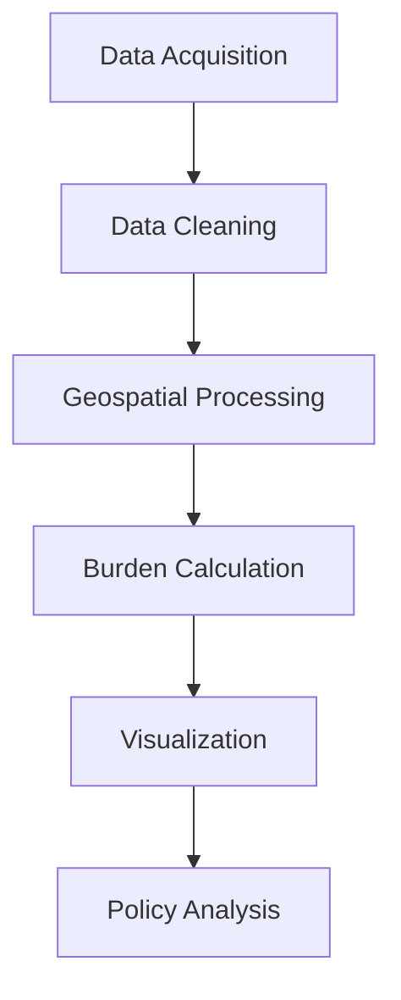

# 🌊 Geospatial analysis of residential rates burden

[](LICENSE)
[](https://www.python.org/)
[](https://wenholma.github.io/christchurch-rates-burden/outputs/christchurch_rates_burden.html)

Geospatial analysis of residential rates burden across Christchurch wards, revealing socioeconomic disparities in local taxation policy.


## 📖 Project Overview
This project overcomes significant data challenges to visualize how rates burden (rates as a percentage of household income) varies across Christchurch. Key findings show:
- 2.5× disparity between highest and lowest burden wards
- Clear east-west socioeconomic divide
- Policy implications for equitable taxation
- Integration with flood risk zones for comprehensive vulnerability assessment

## 🚀 Key Features
- Python-powered geospatial analytics
- Dual-output visualization (static + interactive)
- Policy-relevant insights for local government
- Modular design for replication in other cities
- Comprehensive data validation framework

## ⚙️ Installation
```bash
git clone https://github.com/wenholma/christchurch-rates-burden.git
cd christchurch-rates-burden
pip install -r requirements.txt
```

## 🧪 Usage
Run the analysis notebook:
```bash
jupyter notebook notebooks/Christchurch_Rates_Burden_Analysis.ipynb
```

Generate the interactive map:
```python
python src/visualization.py
```

## 📊 Key Visualizations
- Static heatmap (`outputs/christchurch_rates_burden.png`)
- Interactive Folium map (`outputs/christchurch_rates_burden.html`)
- Policy intervention flowchart (`docs/Policy_Intervention_Flowchart.png`)
- Civic stress diagnostic framework (`docs/Civic_Stress_Framework.png`)

## 📂 Repository Structure
```
christchurch-rates-burden/
├── data/
│   ├── raw/                  # Original data files
│   └── processed/            # Cleaned datasets
├── notebooks/
│   └── Christchurch_Rates_Burden_Analysis.ipynb
├── outputs/                  # Generated visualizations
├── src/                      # Core Python scripts
├── docs/                     # Technical documentation
├── .gitignore
├── LICENSE
├── requirements.txt
└── README.md
```

## 🔍 Methodology


## 📈 Key Findings
| Ward             | Rates Burden | Median Income | Flood Risk |
|------------------|--------------|---------------|------------|
| Linwood Ward     | 6.7%         | $45k          | High       |
| Heathcote Ward   | 6.5%         | $47k          | High       |
| Riccarton Ward   | 4.8%         | $62k          | Moderate   |
| Fendalton Ward   | 2.5%         | $120k         | Low        |

## 🛠️ Technical Challenges & Solutions
| Challenge | Solution | Code Snippet |
|-----------|----------|--------------|
| CCC data unavailable | Used Stats NZ boundaries | `gpd.read_file("ward-2025.shp")` |
| Income data retirement | Synthetic generation with validation | `pd.merge(income_stats, region_filters)` |
| Ward name mismatches | Manual cross-referencing | `wards['WARD2025_2'].unique()` |
| Mobile tooltips | CSS-enhanced Folium popups | `style="background-color: white;"` |

## 🚧 Roadmap
- [x] Initial geospatial analysis
- [x] Static visualization
- [x] Interactive map
- [ ] Property-level rates API integration
- [ ] Time-series animation
- [ ] Multi-city container deployment

## 📜 License
This project is licensed under the MIT License - see [LICENSE](LICENSE) for details.

## 📬 Contact
**Marece Wenhold**  
https://www.linkedin.com/in/marecewenhold/
